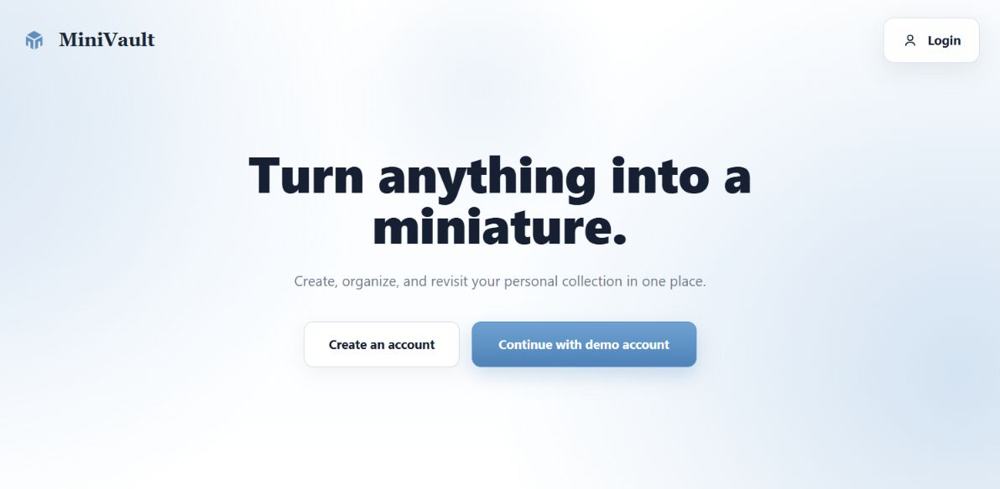
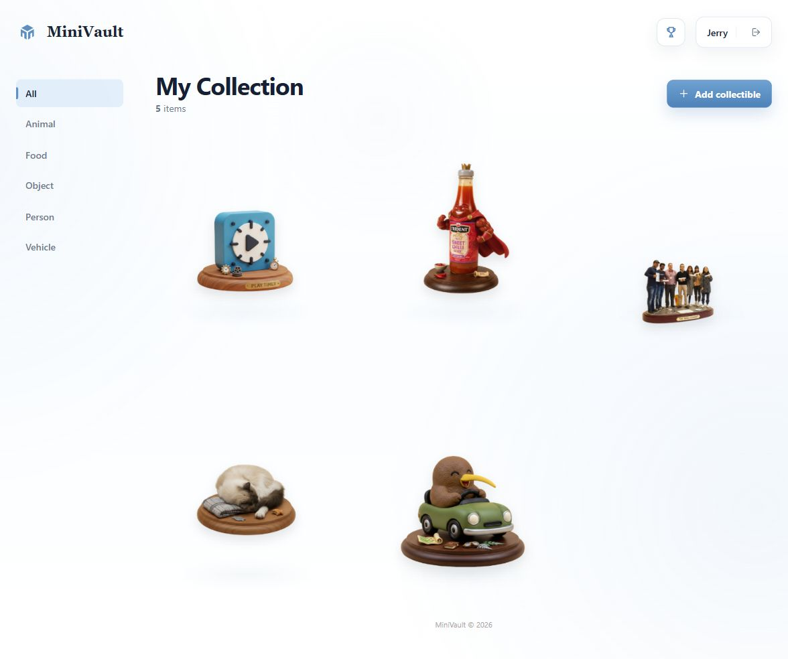
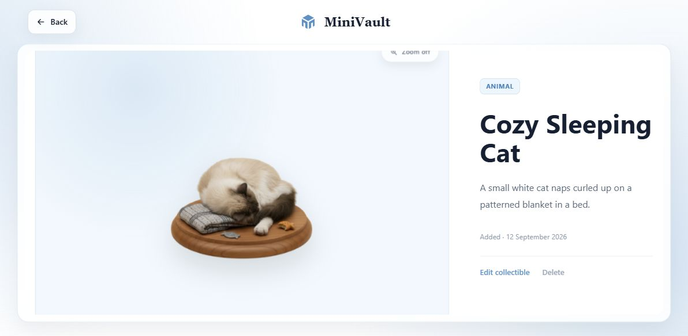
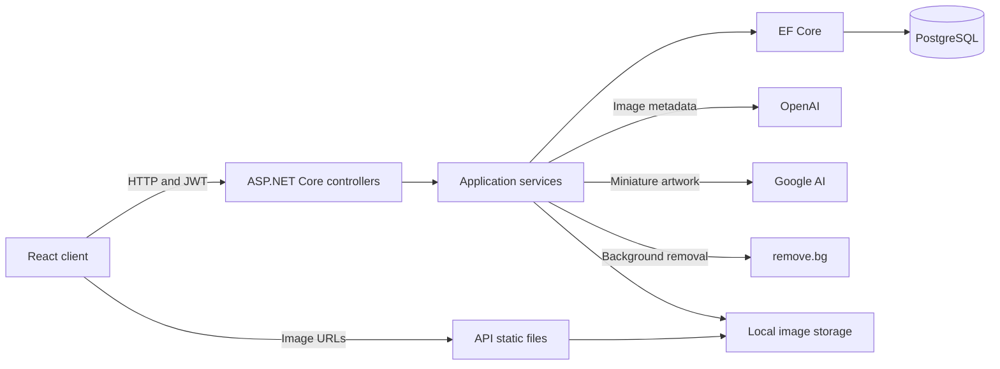

# MiniVault

A full-stack web application that turns photos into AI-generated miniature collectibles and keeps them in a personal digital collection.

**[Live Demo](https://minivault.online)** | **[API Reference](https://minivault-api-ejf7d3g8awahg4ev.australiaeast-01.azurewebsites.net/scalar/v1)**

Choose **Continue with demo account** to explore the hosted application without registering. The demo uses a shared account; changes to its collection are visible to other visitors.



## Overview

MiniVault combines image analysis, image generation, and background removal in one upload workflow. Users can revisit generated artwork, organize collectibles by category, edit their metadata, and track collection achievements.

The repository contains the React client, ASP.NET Core API, database migrations, automated tests, and Azure deployment workflows.

### From Photo to Collectible

An example from the project's presentation page:

| Original photo | Generated miniature |
| --- | --- |
|  |  |

## Key Features

- Photo-to-miniature generation with an automatically generated title, category, and description.
- Personal collection browsing, category filtering, and collectible detail views.
- Editing and deletion of collectibles, restricted to their owner.
- Account registration, JWT login, and a shared demo-account entry point.
- Collection achievements based on total items and category counts.

## Screenshots

### Collection



### Collectible Details



## Tech Stack

| Area | Technologies |
| --- | --- |
| Frontend | React 19, TypeScript, Vite 8, React Router, Bootstrap / React Bootstrap, CSS |
| Backend | C#, ASP.NET Core / .NET 10, Entity Framework Core 10 |
| Database | PostgreSQL, Npgsql EF Core provider |
| AI and images | OpenAI .NET SDK, Google GenAI SDK, remove.bg HTTP API |
| Testing | Vitest, React Testing Library, jsdom; xUnit, EF InMemory, SQLite in-memory, Coverlet collector |
| Delivery | GitHub Actions, Azure Static Web Apps, Azure App Service |
| API documentation | ASP.NET Core OpenAPI, Scalar |

## Architecture



Controllers handle HTTP requests and authentication; services implement collection, user, achievement, and generation behavior. Services access the database through `AppDbContext` directly.

The upload request runs these steps sequentially:

1. Validate and store the original image.
2. Ask OpenAI (`gpt-5.4-nano`) for JSON metadata.
3. Ask Google AI (`gemini-2.5-flash-image`) for miniature artwork.
4. Remove the generated image's background through remove.bg.
5. Save the collectible, delete the intermediate artwork, and refresh achievement progress.

Google image generation retries selected transient errors with exponential backoff. Failed generation attempts clean up partially stored files before the collectible is saved. This workflow runs inside the HTTP request, not in a background queue.

Image files are stored under `backend/wwwroot/uploads` in development and `/home/data/minivault/uploads` outside development. The database stores image URLs; the API serves files through `/uploads`.

## Project Structure

```text
MiniVault/
  frontend/          React client, API helpers, components, and frontend tests
  backend/           Controllers, services, DTOs, models, and EF Core migrations
  backend.Tests/     User, collection, and achievement service tests
  .github/workflows/ Frontend and backend Azure deployment workflows
  docs/              Standalone presentation page and existing screenshots
  specs/             AI-assisted development prompt notes
```

## Getting Started

The frontend and backend run directly from source and connect to a local PostgreSQL database. These instructions follow the current repository configuration; fresh-clone verification is still pending.

### Prerequisites

- Node.js 22.13 or newer within the 22.x series, with npm, for the current frontend dependencies.
- .NET 10 SDK.
- PostgreSQL installed and running locally, with pgAdmin or the `psql` command-line client for database setup.
- API keys for OpenAI, Google AI, and remove.bg to generate new collectibles. Registration, login, and collection browsing do not require these keys.

The examples below use **PowerShell 7**. Environment variables apply to the terminal in which they are set.

### 1. Clone the repository

```powershell
git clone https://github.com/vittorio777/MiniVault.git
cd MiniVault
```

### 2. Prepare PostgreSQL

Install PostgreSQL and start its database service. The examples use its usual local port, **5432**; adjust the connection string if your installation uses a different port.

Connect as a PostgreSQL administrator through pgAdmin's Query Tool or `psql`:

```powershell
psql -h localhost -p 5432 -U postgres -d postgres
```

For a new local setup, run these statements separately, outside a transaction. Replace the password placeholder with your own local database password:

```sql
CREATE USER minivault WITH PASSWORD 'your-local-database-password';
CREATE DATABASE mineplus OWNER minivault;
```

If using `psql`, enter `\q` to return to PowerShell. If the database and user already exist, reuse them and set the connection string to match. The application user must be able to create and alter tables in that database.

Start with an empty database. The repository includes schema migrations and achievement seed data, but does not include a database backup, user accounts, or existing collectibles. Tables and achievement definitions are created automatically when the backend starts.

Database and user creation are one-time setup steps. Once PostgreSQL is running and the connection string is configured, each backend startup automatically applies any pending migrations. Frontend startup does not perform database migrations.

### 3. Configure and start the backend

In a terminal at the repository root:

```powershell
$env:ConnectionStrings__DefaultConnection = "Host=localhost;Port=5432;Database=mineplus;Username=minivault;Password=your-local-database-password"
$env:Jwt__SecretKey = [Convert]::ToBase64String([Security.Cryptography.RandomNumberGenerator]::GetBytes(48))

# Optional for browsing; required before generating new collectibles.
# Replace the placeholders with your own API keys before running these lines.
# $env:OPENAI_API_KEY = "your-openai-api-key"
# $env:GOOGLEAI_API_KEY = "your-google-ai-api-key"
# $env:REMOVE_BG_API_KEY = "your-remove-bg-api-key"

dotnet restore backend/backend.csproj
dotnet run --project backend/backend.csproj --launch-profile http
```

The API starts at `http://localhost:5158`. It automatically applies EF Core migrations and seeds five achievement definitions. The configured database must be available and the database user must have permission to apply migrations. No separate `dotnet ef` step is required for this startup path.

Check `http://localhost:5158/api/health` for `MiniVault API Running`, or open `http://localhost:5158/scalar/v1` for API documentation.

### 4. Configure and start the frontend

In a second terminal at the repository root:

```powershell
cd frontend
Copy-Item .env.example .env
npm ci
npm run dev -- --host localhost --port 5173 --strictPort
```

The copy step is for a fresh clone; preserve an existing `.env` with your own settings. Open `http://localhost:5173`. The current CORS policy allows that exact origin; using `127.0.0.1` or a different port can cause API requests to fail.

Create an account to use a new local database. Migrations do not seed users or collectibles, so the shared Jerry demo login is not available in a fresh database unless that account is created separately. Without AI keys, a new collection remains empty; generating an item requires all three external services.

## Environment Variables

| Variable | Purpose |
| --- | --- |
| `VITE_API_BASE_URL` | Frontend API origin, without a trailing `/api`; local development uses `http://localhost:5158` |
| `ConnectionStrings__DefaultConnection` | Backend PostgreSQL connection string |
| `Jwt__SecretKey` | Backend JWT signing key; use a private random value rather than the committed development default |
| `Jwt__Issuer`, `Jwt__Audience`, `Jwt__ExpirationMinutes` | JWT identity and lifetime settings; defaults are in `backend/appsettings.json` |
| `OPENAI_API_KEY` | OpenAI image analysis and metadata generation |
| `GOOGLEAI_API_KEY` | Google AI miniature image generation |
| `REMOVE_BG_API_KEY` | remove.bg background removal |

ASP.NET Core also accepts `OpenAI:ApiKey`, `GoogleAI:ApiKey`, and `RemoveBg:ApiKey` configuration entries (environment equivalents: `OpenAI__ApiKey`, `GoogleAI__ApiKey`, `RemoveBg__ApiKey`). These take precedence over the uppercase API key variables.

[`frontend/.env.example`](frontend/.env.example) supplies the local frontend origin. Vite loads frontend environment files at startup/build time; restart the dev server after changing them. `VITE_` values are public client configuration, so never put secret keys there. `.env.production` selects the hosted API during a normal production build.

The root [`.env.example`](.env.example) lists the backend API key variable names as a reference. **`dotnet run` does not automatically load `.env` files**; set backend variables in the terminal before starting the API, as shown above. Local `.env` files are ignored by Git.

The `Cors:AllowedOrigins` configuration section currently does not control CORS. Allowed origins are defined in `backend/Program.cs`.

## Testing

Run frontend checks from `frontend/`:

```powershell
npm run test:run
npm run lint
npm run build
```

`npm test` runs Vitest in watch mode. The five frontend test files contain 32 test cases covering authentication helpers, the login modal, category selection, collection rendering, and delete confirmation interactions. API requests in these tests are mocked.

Run backend tests from the repository root:

```powershell
dotnet test backend.Tests/backend.Tests.csproj
dotnet test backend.Tests/backend.Tests.csproj --collect:"XPlat Code Coverage"
```

The three backend test files contain 14 xUnit cases covering registration and login, collection creation/query/update/deletion and ownership checks, and achievement initialization/progress/unlocking. User-service tests use SQLite in-memory; collection and achievement tests use EF InMemory. Coverage output is written under `backend.Tests/TestResults`.

These tests do not exercise real PostgreSQL migrations, external AI services, Azure deployment, or a complete browser workflow. Frontend coverage tooling is not configured. Test counts describe the current source, not a verified passing run or coverage percentage.

## CI/CD

| Workflow | Triggers | Actual steps |
| --- | --- | --- |
| [Frontend](.github/workflows/azure-static-web-apps-polite-coast-0b83c1900.yml) | Push to `main`; PR opened, synchronized, reopened, or closed against `main` | Azure Static Web Apps action builds `frontend/` and deploys `dist`; closing a PR closes its preview deployment |
| [Backend](.github/workflows/main_minivault-api.yml) | Push to `main`; manual dispatch | Set up .NET 10, build and publish the API, upload an artifact, authenticate to Azure, deploy to the App Service Production slot |

Neither workflow explicitly runs automated tests or lint. Backend PR builds are not configured. Frontend PR previews use the committed production API address and therefore target the hosted backend.

The frontend workflow uses a Static Web Apps deployment-token secret and `GITHUB_TOKEN`. The backend uses Azure client-ID, tenant-ID, and subscription-ID secrets with OIDC authentication. Exact secret names are in the workflow files; secret values are not in the repository.

## Deployment

- **Frontend:** Azure Static Web Apps, with the custom domain `minivault.online`.
- **Backend:** Azure App Service, application `minivault-api`, deployed by the backend workflow.
- **Database:** PostgreSQL selected through `ConnectionStrings__DefaultConnection`. The repository does not establish the hosted database provider or instance configuration.
- **Images:** Filesystem storage; outside development the application uses `/home/data/minivault/uploads`. Persistence depends on the hosting environment providing persistent storage at that path.

A separate deployment needs a PostgreSQL connection string, a private JWT signing key, and all three API keys for generation. Set these in the hosting environment. Database migrations run when the API starts. Hosting provisioning, custom-domain setup, and database creation are not automated by the repository workflows.

## Security

- JWT bearer validation checks signature, issuer, audience, and expiration.
- Collection and achievement endpoints require authentication. Collection queries and mutations include the authenticated user's ID.
- New passwords use salted PBKDF2-SHA256 with 100,000 iterations and fixed-time hash comparison. Successful legacy SHA-256 logins upgrade the stored hash.
- DTO validation constrains required fields, lengths, and email format. The generation upload validator accepts JPG, JPEG, PNG, and WebP files up to 20 MB.
- Image storage generates filenames and checks that resolved paths remain inside the uploads directory.
- CORS permits a fixed set of local and deployed frontend origins.

The demo account is shared and has normal collection permissions. Image URLs are served as static files without authentication. Development database credentials and JWT defaults must not be used for a public deployment. The application does not currently implement request rate limiting.

## Technical Decisions and Trade-offs

- **EF Core and PostgreSQL:** Services use a single database context with versioned schema migrations. This keeps the data flow straightforward; several integrity rules currently rely on application checks rather than database constraints.
- **Separate frontend and API:** The client can be built and deployed independently. This requires consistent API origins and CORS settings across development, preview, and production.
- **Multiple AI services:** Metadata analysis, image generation, and background removal have distinct implementations. A capture depends on three providers and their latency, availability, and quotas.
- **In-memory collection cache:** A five-minute cache per user reduces repeated collection queries and is invalidated after mutations. Cache state is local to one API process.
- **Filesystem image storage:** One storage interface supports development and the current Azure-oriented path without another storage service. This couples persistence to the host and is not shared object storage.
